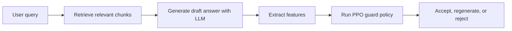

# NoDelulu AI

> A grounded-answer prototype that combines retrieval-augmented generation (RAG), web comparison, and a PPO-based guard layer to reduce low-confidence responses.

## Overview

NoDelulu AI is a full-stack prototype for answering questions with stronger grounding. It starts with a local knowledge source, generates an answer with an LLM, extracts lightweight trust signals, and lets a reinforcement-learning policy decide whether to accept, regenerate, or reject the response.

The current app supports:

- A browser UI for asking questions
- A default knowledge base loaded from `document.txt`
- Optional `.txt` uploads to replace the default context at query time
- A Flask API that returns the answer, raw draft, guard action, and similarity metrics
- A PPO policy that chooses one of three actions: `ACCEPT`, `REGENERATE`, or `REJECT`

## How It Works



Pipeline summary:

1. The app retrieves the most relevant chunks from `document.txt` or the uploaded text file.
2. The LLM generates an initial answer using the retrieved context.
3. The feature layer scores the answer using length, uncertainty language, document similarity, and web similarity.
4. The PPO policy predicts whether the draft should be accepted, regenerated, or rejected.
5. The frontend displays the final answer together with the raw answer and guard metrics.

## Project Layout

| File | Purpose |
| --- | --- |
| `app.py` | Flask server and main RAG -> LLM -> RL pipeline |
| `index.html` | Frontend UI |
| `config.py` | API keys and model settings |
| `rag.py` | Simple TF-IDF-based retrieval |
| `llm_api.py` | OpenAI wrapper |
| `features.py` | Feature extraction and similarity scoring |
| `web_search.py` | Web snippet lookup through SerpAPI |
| `env.py` | Gymnasium environment for the RL guard |
| `train.py` | PPO training script |
| `run.py` | CLI runner |
| `document.txt` | Default knowledge base |
| `rl_guard_policy` | Saved PPO policy used at runtime |

## Quick Start

### 1. Create a virtual environment

```bash
python -m venv .venv
```

Activate it:

- Windows PowerShell: `.venv\Scripts\Activate.ps1`
- macOS / Linux: `source .venv/bin/activate`

### 2. Install dependencies

```bash
pip install -r requirements.txt
pip install flask flask-cors google-search-results
```

Why the second command? The current code imports `flask`, `flask-cors`, and the SerpAPI client, but those packages are not yet listed in `requirements.txt`.

### 3. Configure API keys

Open `config.py` and replace the keys with your own values:

```python
SERPAPI_KEY = "your-serpapi-key"
OPENAI_API_KEY = "your-openai-api-key"
```

Important: avoid committing real API keys to the repository.

### 4. Start the app

```bash
cd C:\Users\aravi\OneDrive\Desktop\NoDeluluAI
python -m venv .venv
.venv\Scripts\Activate.ps1
pip install -r requirements.txt
pip install flask flask-cors google-search-results
python run.py
```

Then open:

```text
http://localhost:5000
```

## Using the App

1. Start the Flask server.
2. Open the web interface in your browser.
3. Optionally upload a `.txt` file to use as the temporary knowledge base.
4. Ask a question.
5. Review the final answer, raw answer, similarity metrics, and PPO action badge.

## API Reference

### `GET /health`

Returns a simple health payload used by the frontend.

Example response:

```json
{
  "status": "ok",
  "model": "gpt-4o-mini",
  "rl": "PPO"
}
```

### `POST /ask`

Submit a question to the pipeline.

Example request:

```json
{
  "query": "What is retrieval-augmented generation?",
  "doc_text": "Optional plain-text knowledge base content"
}
```

Example response:

```json
{
  "answer": "Final answer shown to the user",
  "raw_answer": "Initial model draft before the guard decision",
  "action": "ACCEPT",
  "badge": "accept",
  "doc_sim": 0.83,
  "web_sim": 0.71,
  "confidence": "77.0%",
  "features": {
    "length": 45,
    "uncertainty": 0,
    "doc_sim": 0.83,
    "web_sim": 0.71
  }
}
```

Returned fields:

- `answer`: final answer after the guard action is applied
- `raw_answer`: original first-pass LLM output
- `action`: `ACCEPT`, `REGENERATE`, or `REJECT`
- `badge`: frontend-friendly status label
- `doc_sim`: similarity between the answer and retrieved document context
- `web_sim`: similarity between the answer and web search snippets
- `confidence`: heuristic confidence string derived from similarity scores
- `features`: raw feature vector values used by the policy

## Training the Guard

The repo also includes the training pieces for the PPO policy:

- `env.py` defines the `RAGGuardEnv` Gymnasium environment
- `train.py` trains a PPO model and saves it as `rl_guard_policy`
- `run.py` provides a simple CLI loop for testing the policy outside the browser

To retrain the policy:

```bash
python train.py
```

## Current Limitations

- The app currently reads API keys directly from `config.py`.
- Uploaded knowledge bases are plain-text only.
- The reported confidence is a heuristic, not a calibrated probability.
- The retrieval layer is intentionally lightweight and uses TF-IDF rather than embeddings.
- The current dependency list in `requirements.txt` is incomplete for the web app runtime.

## Why This Project Is Interesting

NoDelulu AI is useful as a research and demo project because it shows how multiple trust layers can be combined in one product:

- retrieval for grounding
- feature engineering for lightweight guard signals
- web comparison for extra consistency checks
- a learned policy for deciding how to handle uncertain outputs

It is especially good for demos, experimentation, academic presentation, and exploring how safety-oriented answer filtering could work in small LLM applications.
